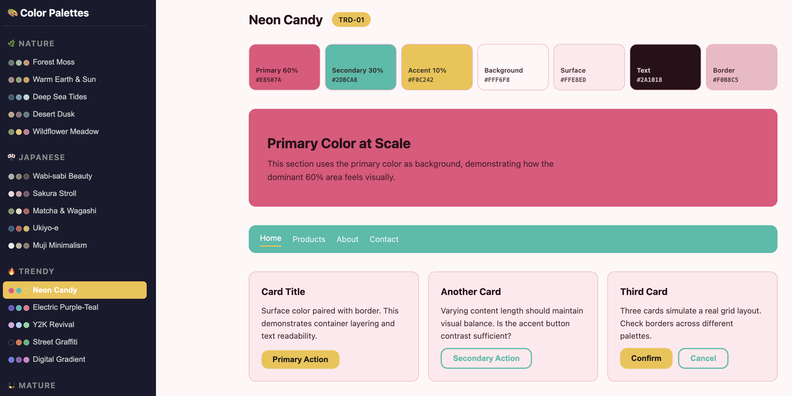
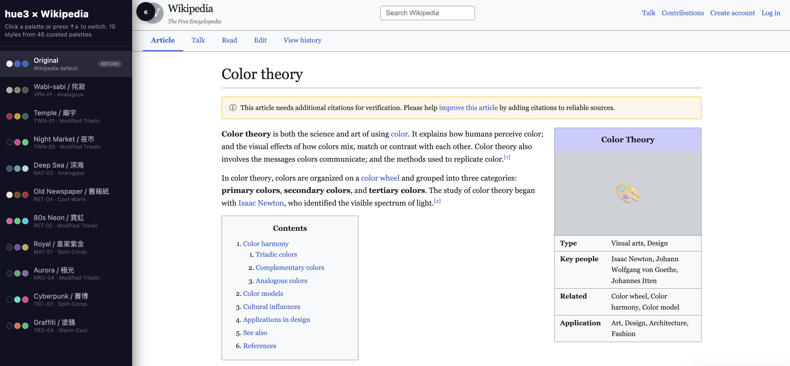
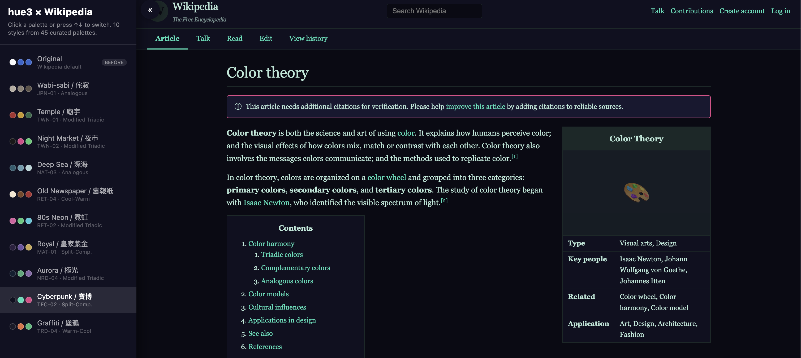

# 🎨 hue3 — Triadic Color Palette Advisor for Claude Code

[](LICENSE)
[](https://claude.ai/claude-code)
[]()
[]()

> **Three colors. One system. Every mood.**

A [Claude Code](https://claude.ai/claude-code) skill that generates beautiful, production-ready color palettes from just three colors using triadic color theory.

**[Live Demo →](https://ktzzypo938.github.io/hue3/)** — Browse all 75 palettes with instant preview
**[Wikipedia Before & After →](https://ktzzypo938.github.io/hue3/wikipedia-before-after.html)** — See hue3 transform a familiar website



### Wikipedia Before & After

Same page, different mood — 16 hue3 palettes applied to Wikipedia's layout:

| Before (Original) | After (Cyberpunk / TEC-02) |
|:--:|:--:|
|  |  |

**[Try it yourself →](https://ktzzypo938.github.io/hue3/wikipedia-before-after.html)** — Switch between 16 styles with one click

## Why hue3?

Most color tools give you a color wheel and leave you on your own. hue3 is different:

- **You describe a mood**, not a hex code — say "cozy Nordic cabin" and get a complete palette
- **Every palette is battle-tested** — curated with proper 60-30-10 ratio, not random generation
- **Instant design system** — not just 3 colors, but background, surface, text, border all derived
- **WCAG built-in** — accessibility isn't an afterthought, it's checked on every output

## Features

- **75 curated palettes** across 15 style categories, each with 5 carefully tuned schemes
- **Mood-first workflow** — describe a feeling, get matching colors (not the other way around)
- **Triadic color theory** — every palette built on proven three-color structures (triadic, split-complementary, analogous, temperature contrast)
- **60-30-10 ratio** — primary, secondary, accent roles with proper area distribution
- **Extended design system** — background, surface, text, border colors derived from the triadic base
- **WCAG accessibility check** — contrast ratios validated for every output
- **Dark mode conversion** — automatic light-to-dark transformation formulas
- **Live HTML preview** — generates a single-file preview website with your palette applied to real UI components
- **Bilingual color names** — English + Chinese/Japanese names for culturally-rooted palettes

## Style Categories

| Style | Keywords | Palettes |
|-------|----------|----------|
| 🌿 Nature | forest, ocean, earth, botanical, organic | 5 |
| 🔥 Trendy | social media, Gen Z, neon, gradient, bold | 5 |
| 🎩 Mature | elegant, luxury, refined, business, sophisticated | 5 |
| 🦅 American | classic USA, cowboy, sports, industrial, Ivy League | 5 |
| 🎌 Japanese | wabi-sabi, sakura, matcha, ukiyo-e, muji | 5 |
| 🏔️ Nordic | Scandinavian, minimal, hygge, fjord, aurora | 5 |
| 📻 Retro | 70s earth, 80s neon, 90s grunge, newspaper, pixel | 5 |
| 💻 Tech | AI, cyberpunk, terminal, space, startup | 5 |
| 🏮 Taiwanese | temple, night market, tea culture, indie, tin roof | 5 |
| 🇰🇷 Korean | K-beauty, K-drama, hanbok, Seoul café, Jeju | 5 |
| 🏛️ Mediterranean | Santorini, Tuscany, Spanish tile, Provence, Adriatic | 5 |
| 🎨 Art Deco | 1920s Gatsby, geometric, gold & black, Jazz Age | 5 |
| 🪑 Mid-Century Modern | Eames, atomic age, Danish design, Palm Springs | 5 |
| 🇫🇷 French | Parisian, pâtisserie, lavender, Riviera, bistro | 5 |
| 🌍 African | kente, savanna, ankara print, baobab, ubuntu | 5 |

## Quick Start

### Installation

```bash
git clone https://github.com/ktzzypo938/hue3.git
mkdir -p ~/.claude/skills/hue3
cp hue3/SKILL.md ~/.claude/skills/hue3/
cp -r hue3/references ~/.claude/skills/hue3/
```

That's it. Open any Claude Code session and start asking about colors.

### Usage

The skill activates automatically when you mention colors, palettes, or visual design:

```
> I need a color scheme for a Japanese wabi-sabi style website
> Give me colors that feel like a Nordic winter cabin
> What palette would work for a cyberpunk dashboard?
> Make it feel like a Taiwanese night market
```

Or trigger it manually:

```
> /color-palettes
```

### What you get

Each recommendation includes:

1. **Triadic base** — 3 colors with Hex, HSL, and role labels
2. **Extended system** — background, surface, text, border
3. **Rationale** — source palette, structure type, hue relationships
4. **Accessibility check** — WCAG AA contrast ratios
5. **HTML preview** — a single-file website you can open in any browser

## Preview Gallery

Open `preview-all.html` in your browser to browse all 75 palettes with a live UI preview. Use **↑↓ arrow keys** to quickly flip through palettes.

The skill also includes `references/preview-template.html` — a single-palette preview with:

- Color swatches (all 7 roles side by side)
- Hero section (primary color at scale)
- Navigation bar (secondary color)
- Card grid (surface + border + buttons)
- Form elements (focus states with accent color)
- Typography sample (text readability check)
- Dark mode toggle (one-click switch)

## File Structure

```
hue3/
├── SKILL.md                          # Main skill definition
├── README.md                         # This file
├── LICENSE                           # MIT License
├── preview-all.html                  # Interactive gallery (all 75 palettes)
├── wikipedia-before-after.html       # Wikipedia reskin demo (10 styles)
├── index.html                        # GitHub Pages entry point
├── preview.png                       # Social preview image
├── wiki-before.png                   # Wikipedia demo — before screenshot
├── wiki-after.png                    # Wikipedia demo — after screenshot
└── references/
    ├── color-theory.md               # Theory: HSL, triadic structures, 60-30-10, WCAG
    ├── preview-template.html         # Single-palette HTML preview template
    ├── nature.md                     # 🌿 5 nature palettes
    ├── trendy.md                     # 🔥 5 trendy palettes
    ├── mature.md                     # 🎩 5 mature palettes
    ├── american.md                   # 🦅 5 American palettes
    ├── japanese.md                   # 🎌 5 Japanese palettes
    ├── nordic.md                     # 🏔️ 5 Nordic palettes
    ├── retro.md                      # 📻 5 retro palettes
    ├── tech.md                       # 💻 5 tech palettes
    ├── taiwanese.md                  # 🏮 5 Taiwanese palettes
    ├── korean.md                     # 🇰🇷 5 Korean palettes
    ├── mediterranean.md              # 🏛️ 5 Mediterranean palettes
    ├── artdeco.md                    # 🎨 5 Art Deco palettes
    ├── midcentury.md                 # 🪑 5 Mid-Century Modern palettes
    ├── french.md                     # 🇫🇷 5 French palettes
    └── african.md                    # 🌍 5 African palettes
```

## Contributing

Contributions are welcome! Here are some ways you can help:

- **Add new style categories** — Bauhaus, Indian, Latin American, Scandinavian Dark...
- **Improve existing palettes** — better color choices, more refined harmony
- **Add new features to SKILL.md** — gradient generation, color blindness simulation
- **Translate** — add more bilingual color names or translate the skill workflow

Please open an issue first to discuss what you'd like to change.

## Inspiration

This skill's three-color philosophy and mood-first approach were inspired by the Japanese design community's emphasis on constraint-driven palette design — particularly the idea that just three well-chosen colors can be more effective than a complex palette. The 60-30-10 ratio and triadic color structures are rooted in classic design education.

## License

[MIT](LICENSE)
